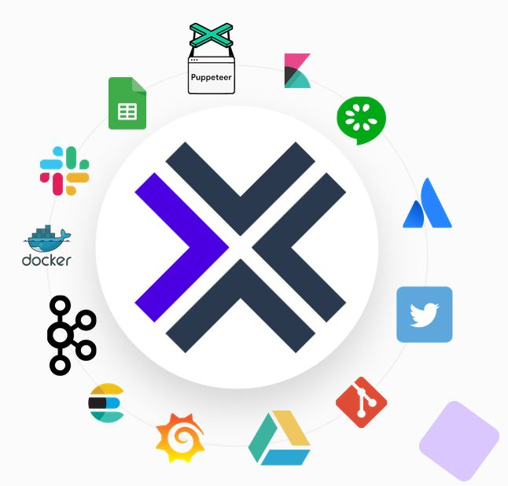
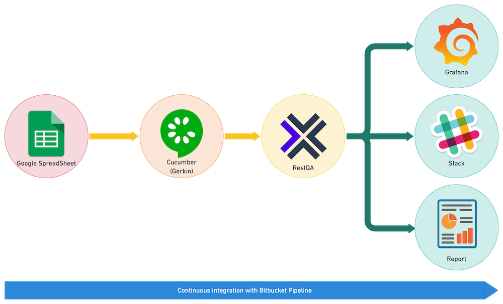
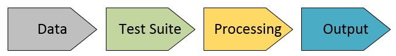
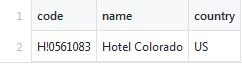
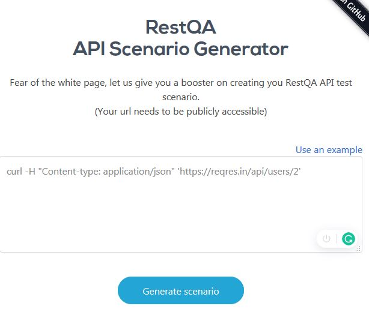

# RestQA 

### Who We Are

------

RestQa is primarily developed by RestQa Labs holding expertise over Open Automation Testing Platform. 

---
[][1][][2][][3]
---


[1]: https://restqa.io
[2]: https://twitter.com/restqa
[3]: mailto:hello@restqa.io

------

### RestQa: A Brief Introduction

------

RestQa converts manual test scenarios into automated test to ease up the testing process with appropriate result published from the RestQa. 	

RestQa is an open source project specifically designed to provide test automation workflow for any Rest based API. RestQa make sure to reduce the testing challenges for the consumer by either letting them manage the RestQa framework or by letting our experts handle it for them.


------

### How RestQa Operate

------

#### 1) Share Product Details

RestQa required the API details over which test automation is to be performed. Details include

- Endpoint URL
- Parameters
- Additional Headers
- Security Protocol details (if implemented)


#### 2) Test Scenarios

------

Next part is to get the scenario details for the Rest API that are to be automated in terms of testing. The information for the Test Suite can be in form of description, video, gif, etc. 


#### 3) Build, Execute & Deliver

------

Based on the information provided, our engineers translate the instructions into a test automation suite. 


#### 4) Deliver Result

------

With in 24 hours, RestQA Automation Pipleline will generate the results and will be integrated with client's reporting environment like Slack, Elasticsearch, etc.



------

### RestQa: Building Components

------

RestQa is build over modules that are integrate able with each other in way to to provide seamless functionality without being totally depended on other modules. RestQa is not an intrusive platform as primary aim is to reduce the learning curve by using open source frameworks and allowing contributors to enhance the code repository if need arises. 



RestQa sits with Bitbucket Pipeline in order to implement Continuous Integration (CI). The aim is to incorporate automate test cycles with CI Workflow in order to scale up the testing process where each new test suite process enters into processing pipeline and generates the output over to the desired reporting platform.



The **Test Automation Pipeline** for RestQa is 4 steps process.

1. **Data:** The data will be the input that is to be passed to the API Endpoint to perform the test. A single endpoint can expect multiple sets of data based on which the result may vary. The data might be in Excel Sheet, CSV based file or Confluence data sheet.

   

2. **Test Suite:** Test Suites are the functional tests representing the business flow written in natural language. This is covered by Cucumber (Gherkins) which follows Behavior-Driven Development (BDD) which allows expected software behaviors to be specified in a logical language that user can understand.

   

3. **Processing:** This is where the magic happens. The data and test suite enters into the processing pipeline which is handled by **RestQApi** which is a part of RestQa Ecosystem and based on **Cucumber-js**.

   

4. **Output:** Post processing, the test results are shared over the desired platform like Grafana, Slack, etc.

------

### Setting up RestQa

------

Entire RestQA process falls under Continuous Integration that is implemented using Bitbucket Pipeline. The Pipeline take over the entire automation process under it and keep on processing as the request appears. Let's dive into the initial setup for RestQA. 

####  Pipeline Configuration

Pipeline configuration is the root file for the setup and defines how the entire testing process will operate. All user's need is configuration file i.e. **restqa.yml** to setup the entire pipeline. The **restqa.yml** sits at the root of the repository and consists of the following part.

- **Metadata Details**: The Metadata consist details about the API along with setting up unique code for it.
- **Environment Details:** This section consist of multiple sub-sections that is related to the input data, testing API details and output reporting platform. This section defines the entire test process and needs to be configured with utmost care.

Below is a sample of **restqa.yml** file for user's reference.

```typescript
---

version: 0.0.1 # Specific test case version
metadata:
  code: Hotel 1.0 # Unique code set for the test 
  name: Hotel Api # Name of the product in testing
  description: E2E test of the weather public api # Description of the product in testing
environments: # List of environment
  - name: sandbox # Name of the environment
    default: true # Define if its the default environment
    secrets: # List of secret to use
      apikey: !env-var API_KEY #This is a secret that will be passed as an environment variable through the test suite.
    data: # Configure an external dataset
      channel: 'csv' # Type of dataset that will contain test data
      config:
        folder: 'data' # Folder were the dataset file is located
    plugins:
      - name: restqapi #Plugin name that contain details for API to be tested
        config:
          url: https://api.worldhotels.org # Host URL of API to be tested
    outputs: # List of outputs 
      - type: file #Export the result into a file
        enabled: true # Enabled the inputs
        config:
          path: 'report-result.json' # Path of the output file which is json in this case	
```

#### Data Set Preparation 

The data set contain the list of values that is required to be passed as a parameter to the test suite. This might be in form of Excel Sheet, CSV based file or Confluence data sheet. For this example, the data will be hosted in CSV file within the repository.



The **code** will be the id based on which the API endpoint is to be consumed. For appropriate automation testing, it is ideal to increase the number of test cases with variance of data to have appropriate test result.

#### Test Suite 

Test suite is where all the magic happens. Test Suite follows common standard to write Behavior Development Design based on Cucumber / Gerkin [https://cucumber.io]. The primary focus is to create automation test scenarios instead of coding. 

>  **{{ hotels.2.code }}** (Hotels CSV / Row # 2 / code Column)

As per the CSV file, the code is a field that is to be passed to the API for automation testing. The tester will specify the Feature along with scenario to the Test Suite.  For our example, it will be something similar to the below.

```gherkin
Feature: |
	As an API consumer
	I WANT TO access the hotel location information
	SO THAT I can build up the detail object for my application
	
@happy
Scenario: Retrieve successfully the information for a hotem with specific code. 
Given I have the api gateway
  And I have the path "/api/v3/hotels"
  And I have the method "GET"
  And the qyery parameter contains "hcode" as "{{ hotels.2.code }}"
  And the header contains "api-key" as "79a229955abepo55694fbf4a54f44fds"
  And the header contains "content-type" as "application/json"
When I run the API
Then I should recieve a response with the status 200
```

The above sample will be a case for successful scenario. However there are failed scenarios as well that needs to be incorporated. An example for unsuccessful scenario is.

```gherkin
Feature: |
	As an API consumer
	I WANT TO access the hotel location information
	SO THAT I can build up the detail object for my application
	
@unhappy
Scenario: Retrieve unsuccessfully due to missing hcode
Given I have the api gateway
  And I have the path "/api/v3/hotels"
  And I have the method "GET"
  And the header contains "accept" as "application/json"
  And the header contains "api-key" as "79a229955abepo55694fbf4a54f44fds"
  And the header contains "content-type" as "application/json"
  When I run the API
  Then I should recieve a response with a status 500
```

To ease things up, RestQa is providing an API Scenario Generator that can help you out to generate Test Suite based scenarios based on the curl command. 

**API Scenario Generator:** <https://api2scenario.restqa.io/>

The API Scenario generator take up the curl command which is formed by an endpoint. 

| Endpoint                      | Curl Command                                                 |
| ----------------------------- | ------------------------------------------------------------ |
| https://reqres.in/api/users/2 | curl -H "Content-type: application/json" 'https://reqres.in/api/users/2' |

Based on the curl command, the RestQa Test Suite prepares the test scenario by executing the command and providing an output of what can be expected in the Reporting Platform later on.




Based on the curl, below test scenario gets generated.

```gherkin
Given I have the api gateway
  And I have the path "/api/users/2"
  And I have the method "GET"
  And the header contains "Content-type" as "application/json"
When I run the API
Then I should receive a response with the status 200
 And the response body at "data.id" should equal 2
 And the response body at "data.email" should equal "janet.weaver@reqres.in"
 And the response body at "data.first_name" should equal "Janet"
 And the response body at "data.last_name" should equal "Weaver"
 And the response body at "data.avatar" should equal "https://s3.amazonaws.com/uifaces/faces/twitter/josephstein/128.jpg"
 And the response body at "ad.company" should equal "StatusCode Weekly"
 And the response body at "ad.url" should equal "http://statuscode.org/"
 And the response body at "ad.text" should equal "A weekly newsletter focusing on software development, infrastructure, the server, performance, and the stack end of things."
```

