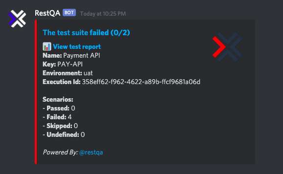

Setting a **Discord** alerting is simple:

## Pre-requisite

 * 1 minute  🚀
 * Create a discord webhook : [Guide to create a webhook on Discord](https://support.discord.com/hc/en-us/articles/228383668-Intro-to-Webhooks)
 * Valid RestQA config file.

## Configuration 

```yaml
environments:
  - name: sandbox
    outputs:
      - type: 'discord'
        enabled: true
        config: 
          url: !env-var DISCORD_WEBHOOK_URL
          onlyFailed: false
          showErrors: false
          reportUrl: 'http://example.com/test-report/{uuid}'
          username: 'bot-name'
```

## command 

if you don't want configure this part manually you can also use the command line :

```
restqa install discord
```


### Options

| *Property*   | *Description*                                                                                | *Default*          |
|:-------------|:---------------------------------------------------------------------------------------------|:-------------------|
| `url`        | The discord webhook url                                                                      |                    |
| `onlyFailed` | Trigger the hook only for test failure                                                       | `true`             |
| `showErrors` | Show the error message within discord                                                        | `false`            |
| `reportUrl`  | The url to access to your detail test report if you have one (`{uuid}` is a placeholder)     |                    |
| `tts`        | enable TTS for the message                                                                   | `false`            |
| `username`   | alternative name for bot, uses the name it has in discord UI by default if nothing specified |                    |


> About the `config.url` we recommend to use the `!env-var` keyword in order to use an [environment variable](/getting-started/environment-variable) and not expose a sensitve url into your configuration.

## Example



