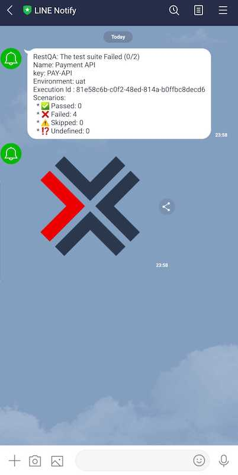

Setting a **Line** alerting is simple:

## Pre-requisite

 * 1 minute  🚀
 * Create a line notify token here:  [https://notify-bot.line.me](https://notify-bot.line.me)
 * Valid RestQA config file.

## Configuration 

```yaml
environments:
  - name: sandbox
    outputs:
      - type: 'line'
        enabled: true
        config: 
          token: !env-var LINE_TOKEN,
          onlyFailed: false
          reportUrl: 'http://example.com/test-report/{uuid}'
```

## Command 

If you don't want to configure this part manually you can also use the command line:

```
restqa install line
```

### Options

| *Property*   | *Description*                                                                                | *Default*          |
|:-------------|:---------------------------------------------------------------------------------------------|:-------------------|
| `token`      | The line notfication token                                                                   |                    |
| `onlyFailed` | Trigger the hook only for test failure                                                       | `true`             |
| `reportUrl`  | The url to access to your detail test report if you have one (`{uuid}` is a placeholder)     |                    |


> About the `token` we recommend to use the `!env-var` keyword in order to use an [environment variable](/getting-started/environment-variable) and not expose a sensitve token into your configuration.

## Example


