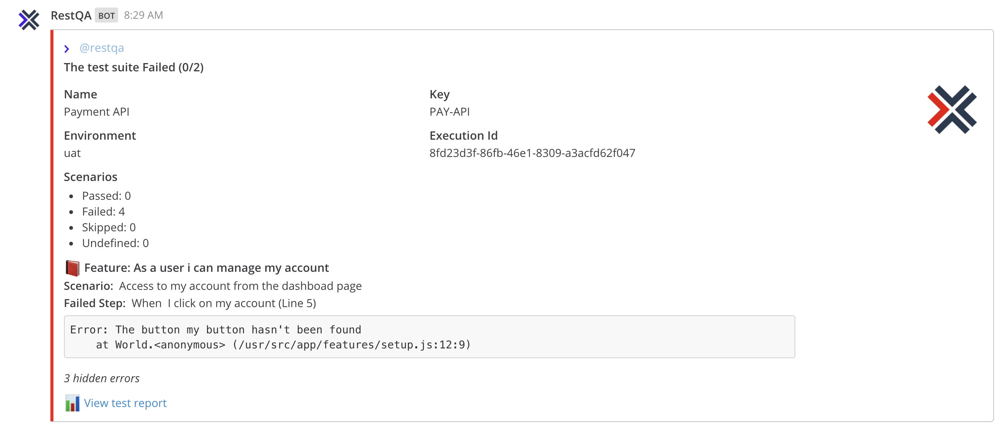

Setting a **Mattermost** alerting is simple:

## Pre-requisite

 * 1 minute  🚀
 * Create a slack incoming webhook : [Webhooks incoming](https://docs.mattermost.com/developer/webhooks-incoming.html)
 * Valid RestQA config file.

## Configuration 

```yaml
environments:
  - name: sandbox
    outputs:
      - type: 'mattermost'
        enabled: true
        config: 
          url: !env-var SLACK_WEBHOOK_URL
          onlyFailed: false
          showErrors: false
          reportUrl: 'http://example.com/test-report/{uuid}'
          channel: 'testing-result'
          username: 'RestQA'
          iconUrl: ''
          iconEmoji: laughing
          displayedErrorsLimit: 25
```

### Options

| *Property*              | *Description*                                                                                        | *Default*          |
|:------------------------|:-----------------------------------------------------------------------------------------------------|:-------------------|
| `url`                   | The mattermost incoming webhook url                                                                  |                    |
| `onlyFailed`            | Trigger the hook only for test failure                                                               | `true`             |
| `showErrors`            | Show the error message within slack                                                                  | `false`            |
| `reportUrl`             | The url to access to your detail test report if you have one (`{uuid}` is a placeholder)             |                    |
| `channel`               | The channel to send messages to                                                                      |                    |
| `username`              | Username to post as (only works if bot is allowed to change its name)                                |                    |
| `iconUrl`               | Link to bot profile picture (only works if bot is allowed to change image)                           |                    |
| `iconEmoji`             | An emoji tag without the ':'s for bot profile picture (only works if bot is allowed to change image) |                    |
| `displayedErrorsLimit`  | Limit the number of errors displayed in one message                                                  | `25`               |


> About the `config.url` we recommend to use the `!env-var` keyword in order to use an [environment variable](/docs/getting-started/environment-variable) and not expose a sensitve url into your configuration.

## Example




