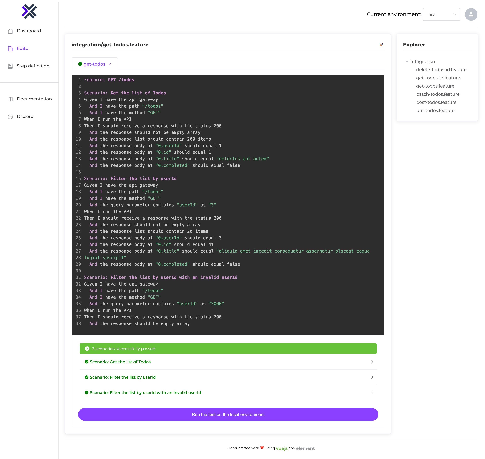

In order to get a user interface allowing you to access to the RestQA feature you can run the command

```bash
restqa dashboad
```

The command above will search for the `.restqa.yml` into the current folder.

Then you should be able to access to the dashboard through the url: http://localhost:8081

example:



:::note Want to try online ?

Check the demo version online 👇

[online dashboard demo](https://dashboard.restqa.io)

:::


### Specify the configuration file

You can also explicitly specify a configuration file to use with the `--config` CLI option (resolved relative to cwd):

```bash
restqa dashboard --config ./tests/.restqa.yml
```

Or through the environment variable `RESTQA_CONFIG`

```bash
RESTQA_CONFIG=my-config.yml restqa dashboard
```

If you don't have `.restqa.yml` configuration file available you can run the command:

```bash
restqa dashboard --no-config
```


### Specify the running port

You can also specify the port if you would like to run the dashboard on different port than `8081`

```bash
restqa dashboard --port 3001
```

Or through the environment variable `RESTQA_PORT`

```bash
RESTQA_PORT=3001 restqa dashboard
```


